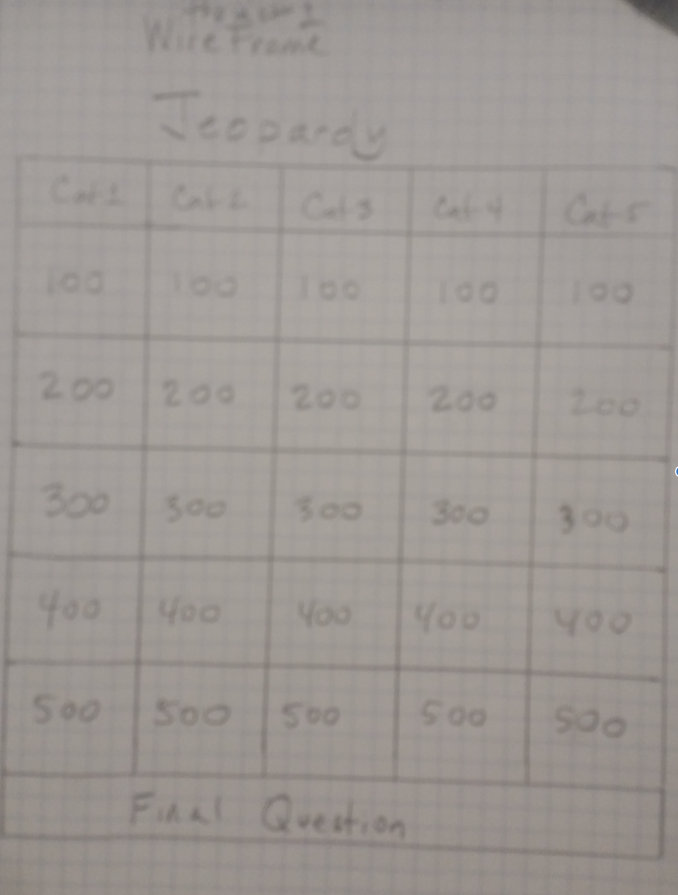

# Project-1: The Jeopardy Game
## Overview 

For project #1, I opted to undertake the Jeopardy game.  I created a simplified, single-player version of this well known TV gameshow.

When a player comes to the site...

**Live site:** <https://d-man-i.github.io/Project-1/>

## Technologies Used

* Languages - HTML5, CSS3, Javascript
* Design - (TBP)
* Project Planning & User Stories - [Trello](https://trello.com/invite/b/0tyWvH8L/a26ae8c77899c5466f494032c7c4198b/ga-sei-21-project-1)
* Visual Studio Code v.1.33.0

## Features

* Gameboard
* (Others TBP)

## Wireframe

## Game Details

(TBP)

## Future Development

* Allow up to 3 players
* Add two daily doubles (randomly selected panels)
* Allow for timed responses (pts deducted when timed-out)
